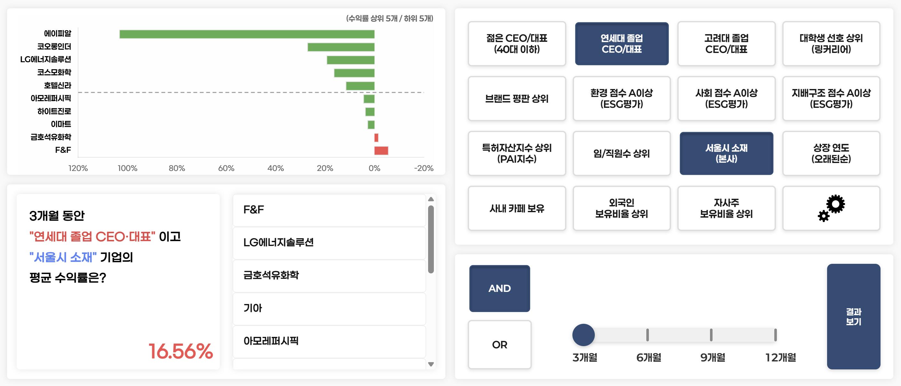
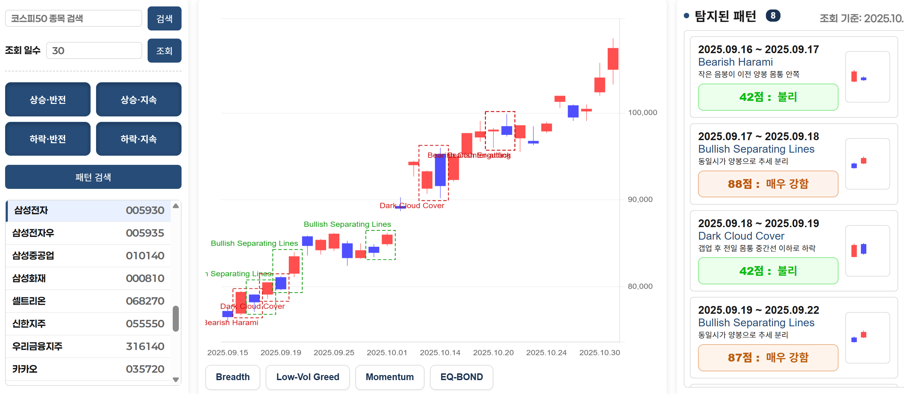

<div align="center">
  
  
  # NewCandle™
  
  ### 경제학적 가설을 검증하고, 데이터를 기반으로 투자의 기준을 세우는 퀀트 분석 플랫폼
  
  []()
  []()
  
</div>

---

## 🎯 프로젝트 소개 (Introduction)

**NewCandle**은 **"느낌"이 아닌 "데이터"로 투자하고 싶은 개인 투자자를 위한 퀀트 분석 플랫폼**입니다.

주식 시장에서 많은 투자자들이 직감, 뉴스 헤드라인, 혹은 주변의 추천에 의존해 매매 결정을 내립니다. 하지만 이러한 감정적 판단은 종종 고점 매수, 저점 매도라는 최악의 결과로 이어지곤 합니다.

**NewCandle은 다릅니다.**  
이 플랫폼은 사용자가 직접 세운 투자 가설—예를 들어 *"ESG 점수가 높은 기업은 장기적으로 수익률이 좋을까?"* 또는 *"외국인 보유 비율이 높은 종목은 안정적일까?"*—을 **실제 시장 데이터로 검증**할 수 있도록 설계되었습니다.

> **💡 핵심 가치**: "감정에 휘둘리지 않고, 논리적인 근거를 바탕으로 투자 결정을 내릴 수 있도록 돕는다."

---

## 🗺️ 플랫폼 구조 (Platform Map)

```
NewCandle™
├── 📊 종목 분석 ─── Smart Dashboard     종목별 차트·지표·재무·심리를 한눈에
├── 📖 투자 정보 ─── Indicator Guide     16개 기술적 지표 백과사전
└── 🔬 AI 연구 ──── Lab Hub
                     ├── 💎 Factor Lab    팩터 조합 백테스팅
                     ├── 🕯️ Candle Lab    캔들 패턴 자동 탐지 + 심리 검증
                     └── 🔥 Theme Lab     테마 사이클 분석 · 예측
```

---

## 🔑 주요 기능 (Key Features)

### 1️⃣ Smart Dashboard — 통합 대시보드

**"종목 분석에 필요한 모든 정보를, 한 화면에서."**

기존 HTS(홈트레이딩시스템)처럼 단순히 정보를 나열하는 것이 아니라, 투자 판단에 실제로 필요한 데이터만 **직관적으로 시각화**합니다. 종목을 선택하면 가격, 기술적 지표, 재무, 현금흐름, 수급, 심리, 뉴스 이슈까지 **하나의 대시보드**에서 확인할 수 있습니다.

#### 대시보드 구성

| 섹션 | 제공 정보 |
|-----|----------|
| **가격 차트** | 일봉 캔들차트 + 거래량 바차트. 최대 1년치 데이터 조회 가능. 이동평균선, 볼린저밴드, Envelope, 일목균형표, Parabolic SAR 등 오버레이 지표 On/Off 선택 |
| **기술적 지표** | MACD, RSI, Stochastic, StochRSI, Williams %R, CCI, ATR, ROC, ADX, Ultimate Oscillator, 거래량, 거래대금 등 12개 보조지표 하단 차트로 표시 |
| **재무 요약** | PER, PBR, ROE, ROA, EPS, BPS, EV/EBITDA, 부채비율, 유보율, 매출액증가율 등 핵심 재무지표 3개년 추이 |
| **현금흐름** | 영업활동/투자활동/재무활동 현금흐름 4개년 추이 차트. 기업의 실질적인 돈 흐름 파악 |
| **수급 현황** | 최근 5영업일 기관·외국인 순매매량 및 순매매강도(거래량 대비 %) 시각화. "스마트머니"의 움직임 추적 |
| **시장 심리** | 종목 토론방 최근 7일 댓글을 NLP로 분석하여 긍정/부정/중립 비율을 도넛 차트로 시각화. 좋아요·싫어요 반응을 가중치로 반영하여 체감 여론 파악 |
| **뉴스 키워드** | 해당 종목 관련 뉴스 헤드라인에서 자주 등장하는 핵심 키워드를 워드클라우드로 시각화. "인수", "실적", "호재" 등 시장이 주목하는 이슈를 한눈에 파악 |

#### 시장 심리의 활용

| 시나리오 | 해석 |
|---------|------|
| **과열 신호 감지** | 긍정 비율이 지나치게 높으면 이미 가격에 기대감이 반영되었을 가능성 |
| **공포 매수 타이밍** | 부정 비율이 극단적으로 치솟았지만 펀더멘털에 문제가 없다면 저가 매수 기회 |
| **이슈 트래킹** | 워드클라우드에서 갑자기 부상하는 키워드로 잠재 리스크나 기회 포착 |

---

### 2️⃣ Factor Lab — 가설 검증소



**"내 투자 철학이 실제로 수익을 낼 수 있을까?"**

Factor Lab은 사용자가 직접 구성한 비재무적·재무적 투자 요인(Factor)을 조합하여, 해당 조건을 만족하는 기업들의 **과거 수익률을 백테스팅**해주는 실험실입니다.

#### 제공되는 15가지 팩터
| 카테고리 | 팩터 |
|---------|------|
| **경영진** | 40대 이하 젊은 CEO, 연세대 출신 CEO, 고려대 출신 CEO |
| **ESG** | 환경 점수 A+, 사회 점수 A+, 지배구조 점수 A+ |
| **브랜드** | 대학생 선호 기업, 브랜드 평판 상위 |
| **조직** | 임직원 수 상위, 서울 본사 소재, 사내 카페 보유 |
| **자산** | 특허 자산지수 상위, 상장 연도 오래된 순 |
| **수급** | 외국인 보유 비율 상위, 자사주 보유 비율 상위 |

#### 사용 방법
1. **팩터 선택**: 최대 3개의 팩터를 자유롭게 선택
2. **조건 설정**: AND(모두 만족) 또는 OR(하나라도 만족) 논리 선택
3. **기간 설정**: 3개월 / 6개월 / 9개월 / 12개월 중 분석 기간 선택
4. **결과 확인**: 조건을 만족하는 기업 목록과 평균 수익률 차트 확인

#### 이런 질문에 답을 얻을 수 있습니다:
- *"ESG 환경 점수가 A+이면서 외국인 보유 비율이 높은 기업, 지난 1년간 수익률은 어땠을까?"*
- *"젊은 CEO가 이끄는 기업이 정말 더 혁신적이고 수익성이 좋을까?"*
- *"특허를 많이 보유한 기업이 장기적으로 경쟁력이 있을까?"*

---

### 3️⃣ Candle Lab — 패턴 탐지



**"차트에서 반복되는 패턴, 놓치지 않습니다."**

기술적 분석의 핵심인 캔들스틱 패턴을 **자동으로 탐지**하고, 시장 심리 데이터로 **예측 신뢰도를 검증**해주는 기능입니다. KOSPI 시가총액 상위 50개 종목을 대상으로, 총 20가지 검증된 캔들 패턴을 실시간으로 스캔합니다.

#### 탐지 가능한 패턴 (20종)

| 유형 | 상승 신호 | 하락 신호 |
|-----|----------|----------|
| **반전 패턴** | 샛별형(Morning Star), 상승장악형(Bullish Engulfing), 상승잉태형(Bullish Harami), 관통형(Piercing), 상승 반격형(Bullish Counter-attack) | 석별형(Evening Star), 하락장악형(Bearish Engulfing), 하락잉태형(Bearish Harami), 먹구름형(Dark Cloud), 하락 반격형(Bearish Counter-attack) |
| **지속 패턴** | 상승 삼법형(Rising Three Methods), 상승 타스키갭(Upside Tasuki Gap), 상승 분리형(Bullish Separating Lines), 적삼병(Three White Soldiers), 상승 스트라이크(Bullish Three-Line Strike) | 하락 삼법형(Falling Three Methods), 하락 타스키갭(Downside Tasuki Gap), 하락 분리형(Bearish Separating Lines), 흑삼병(Three Black Crows), In-Neck, Thrusting Line |

#### Market Psychology — 심리 점수 4축

패턴이 발생한 시점의 시장 분위기를 **4가지 축**으로 정량화하여, 패턴 신호의 **데이터 신뢰도(Data Confidence)**를 산출합니다. 단순한 패턴 형태뿐 아니라, 해당 시점의 시장 심리까지 종합적으로 고려합니다.

| 축 | 의미 | 높을수록 |
|---|------|---------|
| **Momentum** | 현재 가격이 125일 이동평균 대비 어느 위치인지 | 탐욕(과열) |
| **Breadth** | 상승일 거래량 vs 하락일 거래량 비율 (30일) | 탐욕(매수세 강함) |
| **Low-Vol** | 30일 변동성의 1년 백분위 | 탐욕(안정적) |
| **Eq-Bond** | 주식 ETF vs 채권 ETF 20일 수익률 차이 | 탐욕(위험선호) |

#### 패턴 탐지의 가치
- **시간 절약**: 50개 종목을 일일이 차트로 확인할 필요 없이, 패턴이 발생한 종목만 빠르게 필터링
- **객관적 기준**: 주관적 해석의 여지를 줄이고, 정량적 조건으로 패턴 판별
- **심리 검증**: 패턴 + 시장 심리를 교차 검증하여 신호의 신뢰도를 수치화

---

### 4️⃣ Theme Lab — 테마 사이클 분석

**"테마주의 흐름을 읽고, 다음 파도를 예측합니다."**

주식 시장에서 **테마(섹터)**는 순환적으로 강세와 약세를 반복합니다. Theme Lab은 87개 테마에 속한 종목들의 가격 데이터를 수집·분석하여, 테마별 **과거 사이클을 시각화**하고 **미래 강세 시점을 예측**합니다.

#### 분석 구성

| 섹션 | 제공 정보 |
|-----|----------|
| **Past Cycle** (과거 사이클) | 최근 1년간 주간 단위로 어떤 테마가 강세를 보였는지 히트맵 달력으로 표시. 슬라이딩 윈도우 방식으로 평균 수익률, 상승 비율, 표준편차, 중앙값을 종합 평가하여 강세 구간을 판별 |
| **Now Trending** (현재 트렌드) | 현재 진행 중인 테마 TOP 순위를 연속 강세 일수 기준으로 표시. 지금 가장 뜨거운 테마가 무엇인지 실시간 파악 |
| **Future Forecast** (미래 예측) | **단기**: 사이클 간격·최근 모멘텀·전년 동기 3가지 시그널의 앙상블 모델로 다음 강세 테마와 시점을 예측. **장기**: 월별 계절성 분석으로 향후 3개월 유망 테마 제시 |

#### 예측 모델 (3-Signal Ensemble)

| 시그널 | 분석 방법 | 가중치 |
|--------|----------|--------|
| **Cycle Interval** | 과거 강세 블록 간 평균 간격을 계산하여 다음 출현 시점 추정 | 40% |
| **Recent Momentum** | 최근 30일 vs 60일 강세 빈도를 비교하여 상승 추세 감지 | 30% |
| **Year-Ago Pattern** | 작년 동일 시기 강세 여부를 확인하여 계절성 반영 | 30% |

#### 이런 분석이 가능합니다:
- *"반도체 테마는 보통 몇 주 간격으로 강세 사이클이 반복될까?"*
- *"지금 가장 뜨거운 테마는 무엇이고, 얼마나 지속되고 있을까?"*
- *"다음 달에 강세가 예상되는 테마는 무엇일까?"*

---

## ✨ 차별점 (Why NewCandle?)

### 기존 HTS·MTS와의 차이

| 구분 | 기존 HTS/MTS | NewCandle |
|-----|-------------|-----------|
| **정보 제공 방식** | 모든 지표를 나열식으로 표시 | 투자 판단에 필요한 핵심만 시각화 |
| **사용자 역할** | 정보를 수동으로 해석 | 가설을 입력하면 시스템이 검증 |
| **패턴 분석** | 차트를 직접 눈으로 확인 | 알고리즘이 자동 탐지 + 심리 검증 |
| **심리 분석** | 제공하지 않음 | 토론방·뉴스 텍스트를 NLP로 분석 |
| **테마 분석** | 단순 테마 종목 목록 제공 | 과거 사이클 시각화 + 앙상블 예측 |

### 코딩 없이 나만의 투자 알고리즘 실험

기존에 퀀트 투자를 하려면 Python이나 R 같은 프로그래밍 언어를 배워야 했습니다. **NewCandle의 Factor Lab**은 클릭 몇 번으로 팩터를 조합하고 백테스팅 결과를 확인할 수 있어, **비개발자도 자신만의 투자 전략을 데이터로 검증**할 수 있습니다.

---

## 💡 기대 효과 (User Benefit)

### 감정에 휘둘리지 않는 의사결정

NewCandle을 사용하면 더 이상 "올랐으니까 팔아야 할까?"나 "빠졌으니까 사야 할까?" 같은 감정적 질문에 시달리지 않아도 됩니다.

대신, 이런 질문을 던질 수 있게 됩니다:

- ✅ *"내가 투자하려는 종목, 토론방 심리가 극단적 공포 구간인가?"*
- ✅ *"이 종목에서 상승 반전 패턴이 발생했고, 시장 심리 신뢰도는 몇 점인가?"*
- ✅ *"외국인과 기관은 최근 매수하고 있는가, 매도하고 있는가?"*
- ✅ *"내가 세운 투자 가설(예: 고ROE + 저PBR)이 과거에 유효했는가?"*
- ✅ *"지금 가장 강세인 테마는 무엇이고, 다음 사이클은 언제 올까?"*

### 데이터 기반 투자의 시작

> **"투자는 예술이 아니라 과학이다."**

NewCandle은 투자를 감에서 데이터로, 추측에서 검증으로 전환시켜 드립니다.
시장에서 살아남는 투자자가 되기 위한 **논리적 근거**를 NewCandle과 함께 쌓아보세요.

---

<div align="center">
  <br/>
  <strong>© 2026 NewCandle™. All rights reserved.</strong>
  <br/><br/>
  <em>"캔들 그 너머의 투자 인사이트"</em>
</div>
